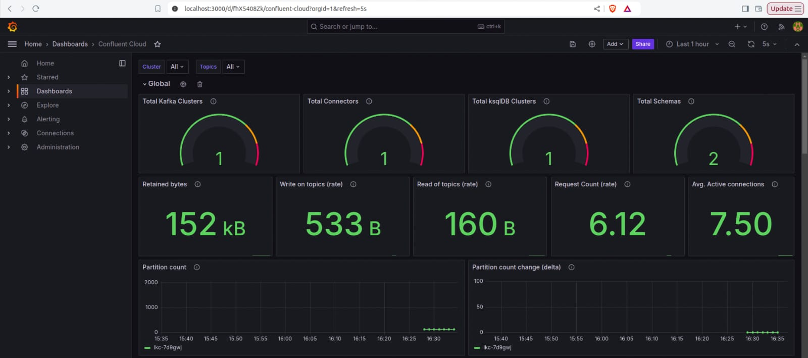

# Prometheus-Grafana Integration with Confluent Cloud Metrics


## Overview

This guide covers setting up Prometheus, Grafana, and Alertmanager to monitor Confluent Cloud metrics and send email alerts.


### Step 1: Docker Compose Setup (If using a containerized setup)

Configure the  docker-compose.yml file for Prometheus and Alertmanager with the below fields as per requirement.

Key Components:

 
**Prometheus Volumes**: Mounts ./prometheus and prometheus_data.
 
**Alertmanager Volumes**: Mounts ./alertmanager/.

**Ports**: Prometheus on 9090, Alertmanager on 9093

### Step 2: Configure Prometheus to Scrape Confluent Cloud

Update prometheus.yml to scrape metrics from the Confluent Cloud API.

```yaml
scrape_configs:

  - job_name: Confluent Cloud

    scrape_interval: 1m

    scrape_timeout: 1m

    honor_timestamps: true

    static_configs:

      - targets:

        - api.telemetry.confluent.cloud

    scheme: https

    basic_auth:

      username: &lt;<CCloud_API_Key>>

      Password: &lt;<CCloud_API_Secret>>

    metrics_path: /v2/metrics/cloud/export

    params:

      #kafka cluster id - add multiple if required

      "resource.kafka.id":

        - lkc-xxxxxx
```

Similarly add ID’s of other required resources

Test the setup by visiting http://your-vm-ip:9090/targets or using a curl command.


### Step 3: Set Up Grafana Dashboards

1. Copy the provisioning folder to Grafana:

   In your repository, locate the provisioning folder, which contains both the dashboards and datasource folders.

   Copy the provisioning folder into your Grafana instance's configuration directory.

   **Configure Grafana to load the dashboards:**

   In the provisioning/dashboards folder, open the dashboard.yml file.

   Add or update the path field to point to the folder where your dashboard JSON files are located:

**Alternative** - Add Dashboards via Grafana UI: If you prefer adding dashboards manually through the Grafana web interface, you can follow these steps:

   Log into Grafana and go to the Dashboards tab.
   
   Click Import in the dashboard panel.
   
   Upload your dashboard configuration JSON file or paste the JSON content directly into the provided area.
   
   Set the data source (Prometheus) as the default for the dashboard.

   Check out this [doc](https://grafana.com/docs/grafana/latest/dashboards/build-dashboards/import-dashboards/) for more information.

2. Update datasource.yml to point to Prometheus (http://your-vm-ip:9090).


3. Dashboards: Confluent Metrics, Billing, ksqlDB.

### Step 4: Configure Alertmanager

Configure alertmanager.yml to send email alerts:

```yaml
route:

    receiver: smtp

receivers:

    - name: smtp

      email_configs:

          - smarthost: mail.your-email-service-domain:port

            hello: your-email-service-domain

            to: 'to@example.com'

            from: 'from@example.com'

            auth_username: 'from@example.com'

            auth_password: 'your-password'

            send_resolved: true

            require_tls: false
```

Test Alertmanager at http://your-vm-ip:9093 


### Step 5: Link Prometheus to Alertmanager

Add the Alertmanager endpoint in prometheus.yml:

```yaml
alerting:

  alertmanagers:

    - static_configs:

        - targets: ['your-vm-ip:9093']   # Replace with your Alertmanager IP and port
```

### Step 6: Set Up Alerting Rules

Create alert_rules.yml for Prometheus to trigger alerts:

```yaml
groups:

  - name: kafka_alerts

    rules:

      - alert: HighKafkaConnections

        expr: max(avg_over_time(confluent_kafka_server_active_connection_count[10m])) > 50

        for: 5m

        labels:

          severity: critical

        annotations:

          summary: "Kafka has high active connections"

          description: "Kafka server active connection count is greater than 50 for more than 5 minutes."

```

This is just an example expression, the expression for the alerting rule should be configured based on the Cluster Usage and maximum tolerable usage.

Link this in prometheus.yml and restart Prometheus and verify if the alerts are seen in the alertmanager UI.


### Step 7: Access Grafana Dashboards


1. Open Grafana at http://your-vm-ip:3000.


2. Log in with 
   username: admin
   password: admin.


3. Browse and select the pre-configured dashboards.
   **Confluent Cloud Dashboard**




This guide outlines how to monitor Confluent Cloud metrics using Prometheus, visualize them in Grafana, and configure Alertmanager for email alerts based on critical thresholds.
